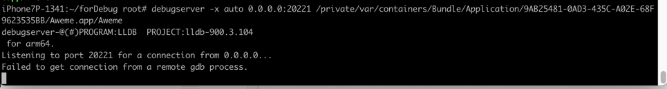

# 常见问题

## Failed to get connection from a remote gdb process

* **现象**

用`debugserver`去调试抖音：

```bash
debugserver -x auto 0.0.0.0:20221 /private/var/containers/Bundle/Application/9AB25481-0AD3-435C-A02E-68F9623535BB/Aweme.app/Aweme
```

报错：

```bash
iPhone7P-1341:~/forDebug root# debugserver -x auto 0.0.0.0:20221 /private/var/containers/Bundle/Application/9AB25481-0AD3-435C-A02E-68F9623535BB/Aweme.app/Aweme
debugserver-@(#)PROGRAM:LLDB  PROJECT:lldb-900.3.104
 for arm64.
Listening to port 20221 for a connection from 0.0.0.0...
Failed to get connection from a remote gdb process.
Exiting.
```



* **原因**

（iPhone7P中的）`debugserver`，多了额外的权限：

* `com.apple.security.network.server`
* `com.apple.security.network.client`
* `seatbelt-profiles`

导致，不允许连接进程（去调试）

* **解决办法**：去掉权限
* **具体步骤**：
用去掉了上述权限：

```xml
    <key>seatbelt-profiles</key>
    <array>
        <string>debugserver</string>
    </array>
...
    <key>com.apple.security.network.server</key>
    <true/>
    <key>com.apple.security.network.client</key>
    <true/>
```

的entitlements文件：

* `debugserver_noSecurity.entitlements`
```xml
<?xml version="1.0" encoding="UTF-8"?>
<!DOCTYPE plist PUBLIC "-//Apple//DTD PLIST 1.0//EN" "http://www.apple.com/DTDs/PropertyList-1.0.dtd">
<plist version="1.0">
<dict>
    <key>com.apple.springboard.debugapplications</key>
    <true/>
    <key>com.apple.backboardd.launchapplications</key>
    <true/>
    <key>com.apple.backboardd.debugapplications</key>
    <true/>
    <key>com.apple.frontboard.launchapplications</key>
    <true/>
    <key>com.apple.frontboard.debugapplications</key>
    <true/>
    <key>com.apple.private.logging.diagnostic</key>
    <true/>
    <key>com.apple.private.memorystatus</key>
    <true/>
    <key>com.apple.private.cs.debugger</key>
    <true/>
    <key>get-task-allow</key>
    <true/>
    <key>task_for_pid-allow</key>
    <true/>
    <key>run-unsigned-code</key>
    <true/>
</dict>
</plist>
```

加到debugserver中 == 重新给debugserver签名：

* 推荐用`codesign`
  ```bash
  codesign -f -s - --entitlements debugserver_noSecurity.entitlements debugserver
  ```
  * 或`iOS < 15`也可以用`ldid`
    ```bash
    ldid -Sdebugserver_noSecurity.entitlements debugserver
    ```

再放到iPhone中==拷贝到iPhone中

```bash
scp debugserver root@192.168.0.58:/usr/bin
```

即可。

## Failed to open log file for writing: errno = 1 (Operation not permitted)

* **现象**

用debugserver调试程序，带日志参数：

```bash
debugserver -l debugservr_20220107_1050.log 0.0.0.0:20221 -a 8829
```

报错：

```bash
iPhone7P-1341:~ root# debugserver -l debugservr_20220107_1050.log 0.0.0.0:20221 -a 8829
Failed to open log file 'debugservr_20220107_1050.log' for writing: errno = 1 (Operation not permitted)debugserver-@(#)PROGRAM:LLDB  PROJECT:lldb-900.3.104
 for arm64.
...
```

* **原因**：
  * **表面原因**：debugserver没有写入（日志文件的）权限
  * **深层次原因**：当前`debugserver`的权限entitlements中有：
    ```xml
        <key>seatbelt-profiles</key>
        <array>
            <string>debugserver</string>
        </array>
    ```
    * 意思是，给debugserver开启了Sandbox
      * 导致：没有（各种的，包括文件）写入的权限
* **解决办法**：把debugserver的entitlements权限中去掉：
    ```xml
        <key>seatbelt-profiles</key>
        <array>
            <string>debugserver</string>
        </array>
    ```
    * 注：再重签名debugserver，写回iPhone，即可。

## Segmentation fault: 11

* **现象**

debugserver调试抖音，报错：

```bash
iPhone7P-1341:~ root# debugserver 0.0.0.0:20221 -a 8829
debugserver-@(#)PROGRAM:LLDB  PROJECT:lldb-900.3.104
for arm64.
Attaching to process 8829...
Segmentation fault: 11
```

* **原因**：此处的iOS的app，`抖音`，内部做了反调试，使得此处调试中断，无法继续调试
* **解决办法**：深入逆向对应app，找到反调试的逻辑，进行反反调试
  * 概述
    * 此处抖音的反调试手段是：二进制`AwemeCore`中用`svc 0x80`的内联汇编实现的`syscall`的`ptrace`的`PT_DENY_ATTACH`
    * 此处反反调试=破解反调试的手段是：把`AwemeCore`中的`svc 0x80`指令替换成`空指令`=`NOP`指令
  * 具体详见
    * [反调试和反反调试 · iOS逆向开发：动态调试](https://book.crifan.org/books/ios_re_dynamic_debug/website/anti_debug_related.html)
