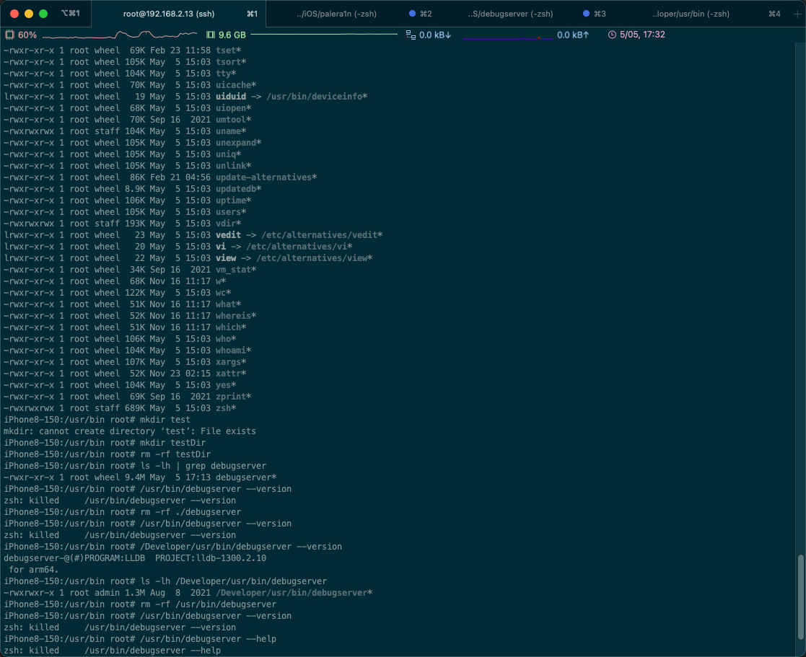
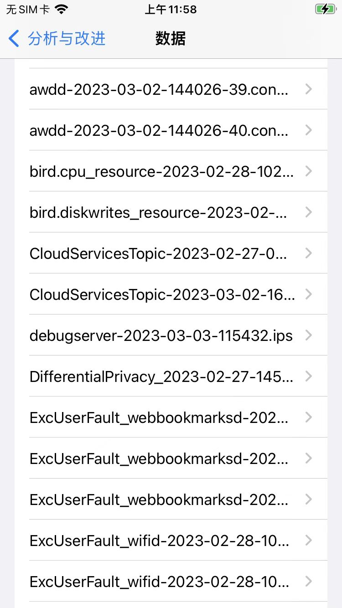
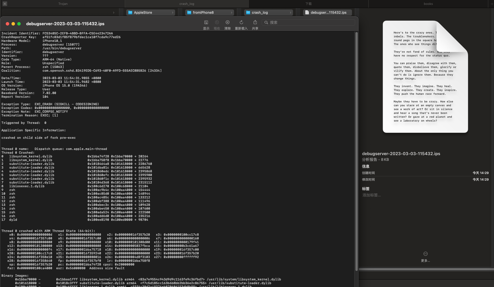
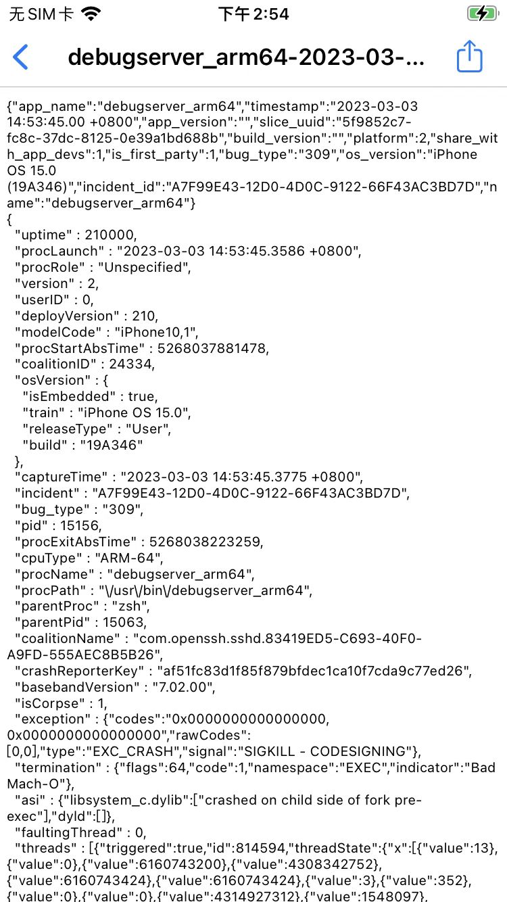

# 运行崩溃killed

重签名后的debugserver运行崩溃：killed

## 现象

### 表面现象

之前用：

```bash
ldid -Sdebugable_entitlement.xml debugserver_debugable
```

给debugserver重签名，加上了额外的可以被调试的权限。

注：此方法，之前在`iOS 14`中，是有效的。

但是此处`iOS 15`中，报错了：运行崩溃killed

```bash
iPhone8-150:/Developer/usr/bin root# debugserver --version
zsh: killed     debugserver --version

iPhone8-150:/usr/bin root# /usr/bin/debugserver --help
zsh: killed     /usr/bin/debugserver --help
```



### 深层次现象

`debugserver`的崩溃日志`.ips`文件：

#### 崩溃日志1



可以看到具体崩溃原因是：



```json
Incident Identifier: FC53485C-2EFB-4BBD-BFFA-C5E4423472AA
CrashReporter Key:   af51fc83d1f85f879bfdec1ca10f7cda9c77ed26
Hardware Model:      iPhone10,1
Process:             debugserver [15077]
Path:                /usr/bin/debugserver
Identifier:          debugserver
Version:             ???
Code Type:           ARM-64 (Native)
Role:                Unspecified
Parent Process:      zsh [15063]
Coalition:           com.openssh.sshd.83419ED5-C693-40F0-A9FD-555AEC8B5B26 [24334]

Date/Time:           2023-03-03 11:54:31.9855 +0800
Launch Time:         2023-03-03 11:54:31.9682 +0800
OS Version:          iPhone OS 15.0 (19A346)
Release Type:        User
Baseband Version:    7.02.00
Report Version:      104

Exception Type:  EXC_CRASH (SIGKILL - CODESIGNING)
Exception Codes: 0x0000000000000000, 0x0000000000000000
Exception Note:  EXC_CORPSE_NOTIFY
Termination Reason: EXEC; [1]

Triggered by Thread:  0

Application Specific Information:

crashed on child side of fork pre-exec

Thread 0 name:   Dispatch queue: com.apple.main-thread
Thread 0 Crashed:
0   libsystem_kernel.dylib                   0x1bba74f28 0x1bba70000 + 20264
1   libsystem_kernel.dylib                   0x1bba758f8 0x1bba70000 + 22776
2   substitute-loader.dylib                  0x1018464a8 0x101618000 + 2286760
3   substitute-loader.dylib                  0x1016ba81c 0x101618000 + 665628
4   substitute-loader.dylib                  0x101860edc 0x101618000 + 2395868
5   substitute-loader.dylib                  0x101860efc 0x101618000 + 2395900
6   substitute-loader.dylib                  0x101860f1c 0x101618000 + 2395932
7   substitute-loader.dylib                  0x10184d368 0x101618000 + 2315112
8   libiosexec.1.dylib                       0x100c6d270 0x100c68000 + 21104
9   zsh                                      0x100ac9b4c 0x100aa4000 + 154444
10  zsh                                      0x100ac85d0 0x100aa4000 + 148944
11  zsh                                      0x100ac485c 0x100aa4000 + 133212
12  zsh                                      0x100abf388 0x100aa4000 + 111496
13  zsh                                      0x100abec3c 0x100aa4000 + 109628
14  zsh                                      0x100abe450 0x100aa4000 + 107600
15  zsh                                      0x100ada524 0x100aa4000 + 222500
16  zsh                                      0x100add6d0 0x100aa4000 + 235216
17  dyld                                     0x100ee8190 0x100ed0000 + 98704

Thread 0 crashed with ARM Thread State (64-bit):
    x0: 0x000000000000000d   x1: 0x0000000000000000   x2: 0x000000016f357b20   x3: 0x0000000100cc17c8
    x4: 0x000000016f357c00   x5: 0x000000016f357c00   x6: 0x0000000000000006   x7: 0x0000000000000160
    x8: 0x0000000000000000   x9: 0x0000000000000000  x10: 0x0000000101308d00  x11: 0x0000000000179f41
   x12: 0x0000000101300000  x13: 0x0000000000000000  x14: 0x000000005037fbca  x15: 0x00000000b3c61a67
   x16: 0x00000000000000f4  x17: 0x00000001bba75718  x18: 0x0000000000000000  x19: 0x000000016f357c00
   x20: 0x0000000100cc17c8  x21: 0x000000016f359240  x22: 0x0000000000000000  x23: 0x000000016f357b20
   x24: 0x000000016f358e10  x25: 0x0000000000000016  x26: 0x000000004d8f3103  x27: 0x00000000ffffff92
   x28: 0x000000016f358640   fp: 0x000000016f357bf0   lr: 0x00000001bba758f8
    sp: 0x000000016f357b20   pc: 0x00000001bba74f28 cpsr: 0x20000000
   far: 0x0000000100ca4000  esr: 0x56000080  Address size fault

Binary Images:
       0x1bba70000 -        0x1bbaa1fff libsystem_kernel.dylib arm64  <83a7e9554c943d9d9c1163fe9c36fbd7> /usr/lib/system/libsystem_kernel.dylib
       0x101618000 -        0x1018c3fff substitute-loader.dylib arm64  <f7c5d185cc163b6b8bb2bb36e2c86755> /usr/lib/substitute-loader.dylib
       0x100c68000 -        0x100c6ffff libiosexec.1.dylib arm64  <fff6c30d2a49376eb070606153db8b99> /usr/lib/libiosexec.1.dylib
       0x100aa4000 -        0x100b33fff zsh arm64  <5f9852c7fc8c37dc81250e39a1bd688b> /usr/bin/zsh
       0x100ed0000 -        0x100f23fff dyld arm64  <d7a0282e93de3a1e981327e84517cc96> /usr/lib/dyld

EOF
```

其中的`Exception Type:  EXC_CRASH (SIGKILL - CODESIGNING)`能看出是：代码签名方面的问题

#### 崩溃日志2



```json
  "exception" : {"codes":"0x0000000000000000, 0x0000000000000000","rawCodes":[0,0],"type":"EXC_CRASH","signal":"SIGKILL - CODESIGNING"},
  "termination" : {"flags":64,"code":1,"namespace":"EXEC","indicator":"Bad Mach-O"},
  "asi" : {"libsystem_c.dylib":["crashed on child side of fork pre-exec"],"dyld":[]},
```

其中的：

* `"signal":"SIGKILL - CODESIGNING"}`：确定是：代码签名方面的问题，导致的崩溃
* `"indicator":"Bad Mach-O"`：具体指示器 ~= 出错的地方/来源：是由于`Bad Mach-O`=Mach-O二进制文件是坏的
  * 后续证明：是签名方面有问题 -》所以是：坏的Mach-O文件

## 原因

`iOS <15`时的旧的重签名的方式=ldid重签名，不满足此处（`arm64`的`A11`的`iPhone8`，`iOS 15.0`）新的`iOS 15+`的要求

## 解决办法

用`codesign`重新签名

## 具体步骤

* 概述
  ```bash
  codesign -f -s - --entitlements debugable_entitlement.xml debugserver
  ```
* 详解
  * [重签名](../usage_note/entitlement/re_codesign.md)
