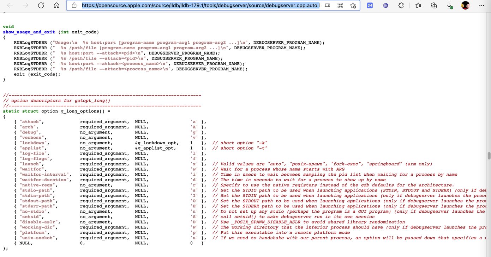

# debugserver的help语法

## 语法概述

```bash
iPhone11-151:~ root# /Developer/usr/bin/debugserver --help
debugserver: unrecognized option `--help'
debugserver-@(#)PROGRAM:LLDB  PROJECT:lldb-1300.2.10
 for arm64.
Usage:
  debugserver host:port [program-name program-arg1 program-arg2 ...]
  debugserver /path/file [program-name program-arg1 program-arg2 ...]
  debugserver host:port --attach=<pid>
  debugserver /path/file --attach=<pid>
  debugserver host:port --attach=<process_name>
  debugserver /path/file --attach=<process_name>
```

## 语法详解

```bash
debugserver [<options>] host:<port> [<prog-name> <arg1> <arg2> ...]
```

参数含义：

* `-a process`
  * Attach debugserver to process. The process can be a pid or executable name
* `-d integer`
  * Assign the waitfor-duration
* `-f ?`
  * ?
* `-g`
  * Turn on debugging
* `-i integer`
  * Assign the waitfor-interval
* `-l filename`
  * Log to file. Set filename to stdout to log to standard output
* `-t`
  * Use task ID instead of process ID
* `-v`
  * Verbose
* `-w` ?
  * ?
* `-x method` `--launch=method`
  * 参数缩写的说明
    * 估计是：**x**，表示`eXecute`=`执行`=`启动运行`=（此参数的全称）`launch`
      * 所以对应的着：`--launch=method`
  * How to launch the program. Can be one of:
    * `auto`: Auto-detect the best launch method to use.
    * `fork`: Launch program using fork(2) and exec(3).
    * `posix`: Launch program using posix_spawn(2).
    * `backboard`: Launch program via BackBoard Services.
      * The backboard option is only available in the closed-source version included in Xcode
* `--lockdown`
  * Obtain parameters from lockdown (?)

## 相关源码

[debugserver.cpp (apple.com)](https://opensource.apple.com/source/lldb/lldb-179.1/tools/debugserver/source/debugserver.cpp.auto.html)



```c
void
show_usage_and_exit (int exit_code)
{
    RNBLogSTDERR ("Usage:\n  %s host:port [program-name program-arg1 program-arg2 ...]\n", DEBUGSERVER_PROGRAM_NAME);
    RNBLogSTDERR ("  %s /path/file [program-name program-arg1 program-arg2 ...]\n", DEBUGSERVER_PROGRAM_NAME);
    RNBLogSTDERR ("  %s host:port --attach=<pid>\n", DEBUGSERVER_PROGRAM_NAME);
    RNBLogSTDERR ("  %s /path/file --attach=<pid>\n", DEBUGSERVER_PROGRAM_NAME);
    RNBLogSTDERR ("  %s host:port --attach=<process_name>\n", DEBUGSERVER_PROGRAM_NAME);
    RNBLogSTDERR ("  %s /path/file --attach=<process_name>\n", DEBUGSERVER_PROGRAM_NAME);
    exit (exit_code);
}

...

//----------------------------------------------------------------------
// option descriptors for getopt_long()
//----------------------------------------------------------------------
static struct option g_long_options[] =
{
    { "attach",             required_argument,  NULL,               'a' },
    { "arch",               required_argument,  NULL,               'A' },
    { "debug",              no_argument,        NULL,               'g' },
    { "verbose",            no_argument,        NULL,               'v' },
    { "lockdown",           no_argument,        &g_lockdown_opt,    1   },  // short option "-k"
    { "applist",            no_argument,        &g_applist_opt,     1   },  // short option "-t"
    { "log-file",           required_argument,  NULL,               'l' },
    { "log-flags",          required_argument,  NULL,               'f' },
    { "launch",             required_argument,  NULL,               'x' },  // Valid values are "auto", "posix-spawn", "fork-exec", "springboard" (arm only)
    { "waitfor",            required_argument,  NULL,               'w' },  // Wait for a process whose name starts with ARG
    { "waitfor-interval",   required_argument,  NULL,               'i' },  // Time in usecs to wait between sampling the pid list when waiting for a process by name
    { "waitfor-duration",   required_argument,  NULL,               'd' },  // The time in seconds to wait for a process to show up by name
    { "native-regs",        no_argument,        NULL,               'r' },  // Specify to use the native registers instead of the gdb defaults for the architecture.
    { "stdio-path",         required_argument,  NULL,               's' },  // Set the STDIO path to be used when launching applications (STDIN, STDOUT and STDERR) (only if debugserver launches the process)
    { "stdin-path",         required_argument,  NULL,               'I' },  // Set the STDIN path to be used when launching applications (only if debugserver launches the process)
    { "stdout-path",        required_argument,  NULL,               'O' },  // Set the STDOUT path to be used when launching applications (only if debugserver launches the process)
    { "stderr-path",        required_argument,  NULL,               'E' },  // Set the STDERR path to be used when launching applications (only if debugserver launches the process)
    { "no-stdio",           no_argument,        NULL,               'n' },  // Do not set up any stdio (perhaps the program is a GUI program) (only if debugserver launches the process)
    { "setsid",             no_argument,        NULL,               'S' },  // call setsid() to make debugserver run in its own session
    { "disable-aslr",       no_argument,        NULL,               'D' },  // Use _POSIX_SPAWN_DISABLE_ASLR to avoid shared library randomization
    { "working-dir",        required_argument,  NULL,               'W' },  // The working directory that the inferior process should have (only if debugserver launches the process)
    { "platform",           required_argument,  NULL,               'p' },  // Put this executable into a remote platform mode
    { "unix-socket",        required_argument,  NULL,               'u' },  // If we need to handshake with our parent process, an option will be passed down that specifies a unix socket name to use
    { NULL,                 0,                  NULL,               0   }
};

```