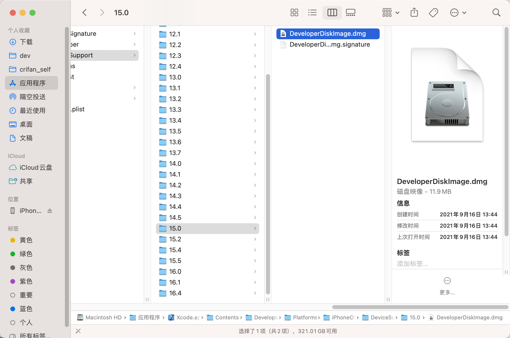
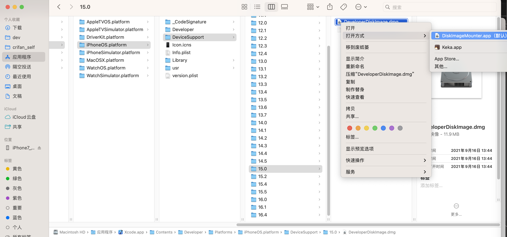
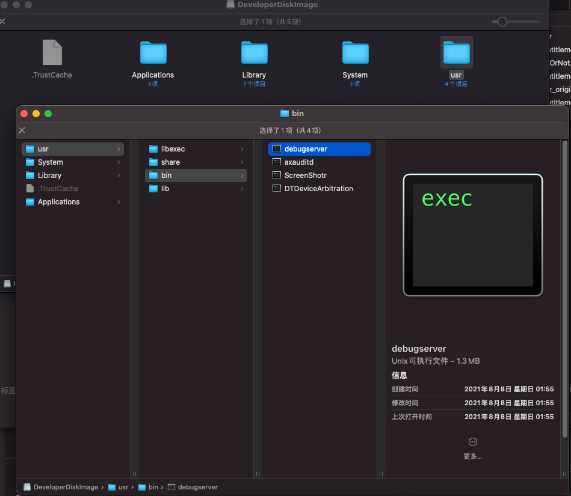

# 原始debugserver位置

我们在讨论iPhone中的`debugserver`，往往是会提到：

* iPhone中的，原始版本的`debugserver`
  * 位置是：`/Developer/usr/bin/debugserver`
  * 特点是：只读，无法修改
    * 所以才会涉及到，拷贝到Mac中，添加可调试等权限，重新签名，写回iPhone（到另外的位置，一般是`/usr/bin/debugserver`）

但是其实该文件来自更早的地方：

* `DeveloperDiskImage.dmg`中的`/usr/bin/debugserver`

## DeveloperDiskImage.dmg

* 关于：`DeveloperDiskImage.dmg`
  * 位置：在Xcode中
    * 举例：`iOS 15.0`
      * `/Applications/Xcode.app/Contents/Developer/Platforms/iPhoneOS.platform/DeviceSupport/15.0/DeveloperDiskImage.dmg`
        * 
  * 如何打开
    * 方式1：`右键`->`DiskImageMounter.app`
      * 
    * 方式2：
      * 双击`DeveloperDiskImage.dmg`，而自动挂载打开
  * 打开后=挂载后
    * 可以查看到其中的`/usr/bin/debugserver`
      * 

-> 即：`iPhone`中的`/Developer/usr/bin/debugserver`，最早就是来自于Xcode中的`DeveloperDiskImage.dmg`中的`/usr/bin/debugserver`
