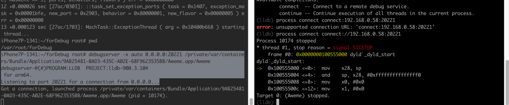

# Mac中用lldb去调试app

然后去Mac中用lldb去调试app（抖音）

概述：

```bash
lldb

process connect connect://192.168.0.58:20221
```

参数说明：

* `192.168.0.58`：是`iPhone`的`IP`地址
* `20221`：是之前`debugserver`启动时设置的端口号

然后Mac中即可愉快的正常的调试了：

```bash
(lldb) b ptrace
Breakpoint 1: no locations (pending).
WARNING:  Unable to resolve breakpoint to any actual locations.
(lldb) c
Process 10174 resuming
1 location added to breakpoint 1
...
```

注：

此时，iPhone的debugserver会输出：

`Got a connection, launched process /private/var/containers/Bundle/Application/9AB25481-0AD3-435C-A02E-68F9623535BB/Aweme.app/Aweme (pid = 10211).`

完整的2端的效果是：


