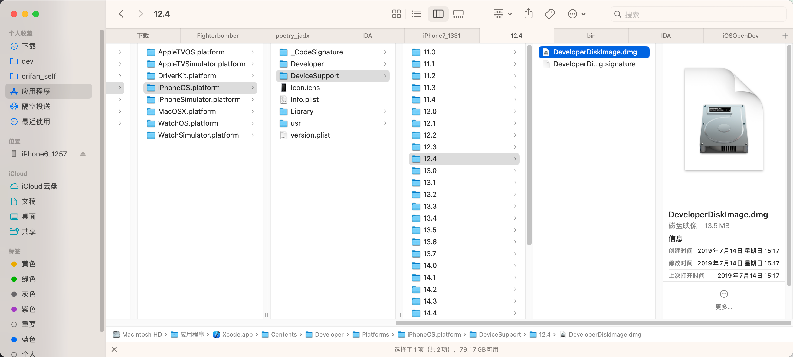
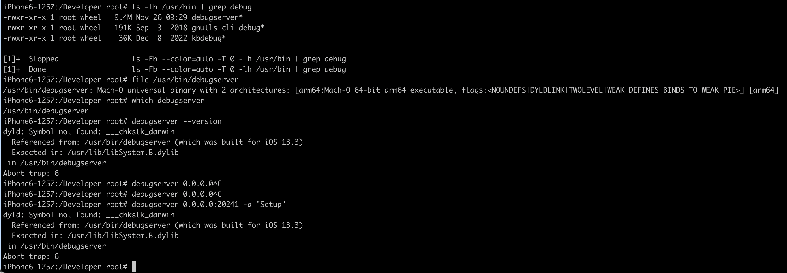

# 确保iPhone中debugserver有正确的权限

## Mac中：从iPhone中导出debugserver到Mac

* 前提
  * 已实现ssh免密登录，所以可以直接用scp去拷贝

```bash
scp root@192.168.0.58:/Developer/usr/bin/debugserver .
```

* 参数说明
  * `root`：`ssh`的用户名
  * `192.168.0.58`：iPhone的IP
  * `/Developer/usr/bin/debugserver`：`iPhone`中的`debugserver`的所在目录，原始的`debugserver`
  * `.`：当前文件夹

### 常见问题

#### 找不到`/Developer/usr/bin/debugserver`

* 如果找不到`/Developer/usr/bin/debugserver`，则说明：之前还没连接过Xcode去调试过此iPhone
  * 具体解释
    * 详见：[debugserver](../debugserver/README.md)
  * 解决办法
    * 自己从`Xcode`对应目录中，找个相同（或最接近的版本的）`DeveloperDiskImage.dmg`
      * 举例
        * 此处就没找到，和此处`iOS 12.5.7`的`iPhone6`匹配的：`iOS 12.5`的，只能找最接近的`iOS 12.4`的
          * `/Applications/Xcode.app/Contents/Developer/Platforms/iPhoneOS.platform/DeviceSupport/12.4/`
            * 
    * 双击后会自动挂载到Mac中的Volume：`/Volumes/DeveloperDiskImage/`
    * 从中提取出`/usr/bin/debugserver`即可
      * 对应完整路径就是：`/Volumes/DeveloperDiskImage/usr/bin/debugserver`

#### debugserver运行报错：dyld Symbol not found Abort trap 6

此处直接尝试用，之前从某个`iOS 13.3.1`的`iPhone7`中拷贝出的（且重签名后的）`debugserver`，放到`iOS 12.4.7`的`iPhone6`中去运行，结果直接报错：

```bash
iPhone6-1257:/Developer root# which debugserver
/usr/bin/debugserver
iPhone6-1257:/Developer root# debugserver --version
dyld: Symbol not found: ___chkstk_darwin
  Referenced from: /usr/bin/debugserver (which was built for iOS 13.3)
  Expected in: /usr/lib/libSystem.B.dylib
 in /usr/bin/debugserver
Abort trap: 6
```



所以说结论就是：

至少是，`iOS`的大版本不同的话，就像此处的：

* `iOS 12`
  * `iOS 12.5.7`
* `iOS 13`
  * `iOS 13.3.1`

则对应的`debugserver`，是无法通用的。

## Mac中：给debugserver加上合适的权限

关于加上合适权限，很多人，其他人，都是说的思路是：

* **多步**：先导出权限，再编辑，最后加上

但是后来确认，直接：

* **一步** = 直接写入合适的权限

即可。

具体步骤：

### 准备好entitlement文件

把下面内容保存为：`debugserver.entitlements`

```xml
<?xml version="1.0" encoding="UTF-8"?>
<!DOCTYPE plist PUBLIC "-//Apple//DTD PLIST 1.0//EN" "http://www.apple.com/DTDs/PropertyList-1.0.dtd">
<plist version="1.0">
<dict>
    <key>com.apple.springboard.debugapplications</key>
    <true/>
    <key>com.apple.backboardd.launchapplications</key>
    <true/>
    <key>com.apple.backboardd.debugapplications</key>
    <true/>
    <key>com.apple.frontboard.launchapplications</key>
    <true/>
    <key>com.apple.frontboard.debugapplications</key>
    <true/>
    <key>com.apple.private.logging.diagnostic</key>
    <true/>
    <key>com.apple.private.memorystatus</key>
    <true/>
    <key>com.apple.private.cs.debugger</key>
    <true/>
    <key>get-task-allow</key>
    <true/>
    <key>task_for_pid-allow</key>
    <true/>
    <key>run-unsigned-code</key>
    <true/>
</dict>
</plist>
```

说明：

（先[导出原始的debugserver的entitlement权限](../usage_note/entitlement/check_entitlement.md)，再经过如下处理）

* 已加上权限：`get-task-allow`、`task_for_pid-allow`、`run-unsigned-code`
  * 目的：允许debugserver调试其他app
* 已去掉权限：`com.apple.security.network.server`、`com.apple.security.network.client`
  * 目的：防止后续lldb调试报错`Failed to get connection from a remote gdb process`
* 已去掉权限：`seatbelt-profiles`
  * 目的：方式后续`debugserver`加上`-l`的日志文件时报错：`Failed to open log file for writing  errno = 1 Operation not permitted`

### 把entitlement权限加到debugserver中

* 概述
  * 推荐用`codesign`
    ```bash
    codesign -f -s - --entitlements debugserver.entitlements debugserver
    ```
* 详解
  * [重签名](../usage_note/entitlement/re_codesign.md)

## Mac中：把加了entitlement权限的`debugserver`拷贝回`iPhone`中

```bash
scp debugserver root@192.168.0.58:/usr/bin/
```

说明：

* 为何没有拷贝回/覆盖原先的`/Developer/usr/bin/debugserver`？
  * 因为`/Developer`是`ramdisk`挂载的，是`readonly`=`只读`的，无法写入
* 为何选择路径`/usr/bin`？
  * 用于存放可执行文件工具的路径，`/usr/bin`是常见之一，比较适合此处用途
    * 其他目录，理论上也可以：
      * `/bin`
      * `/sbin`
      * `/usr/sbin`
      * 等
  * 注意：确保iPhone中的`PATH`环境变量包含此处所用路径即可
    * 目的：便于后续其他任何位置都能找的到和能直接调用`debugserver`
    * 如何查看当前环境变量值：`echo $PATH`
      * 举例
        ```bash
        # echo $PATH
        /usr/local/sbin:/usr/local/bin:/usr/sbin:/usr/bin:/sbin:/bin:/usr/bin/X11:/usr/games
        ```
