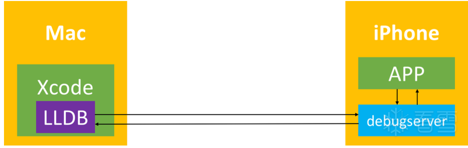

# debugserver+lldb概览

* `debugserver+lldb`
  * 是什么：[iOS逆向](https://book.crifan.org/books/ios_reverse_dev/website/)中[动态调试](https://book.crifan.org/books/ios_re_dynamic_debug/website/)的其中一种手段
    * 对比来说，其他手段还有：[MonkeyDev](https://book.crifan.org/books/ios_re_monkeydev_debug/website/)、[Frida](https://book.crifan.org/books/reverse_debug_frida/website/)等等
  * 交互方式：**命令行**
    * 优点：通用、兼容
    * 缺点：（相对GUI图形界面说）不够直观
  * 基本架构
    * 
    * 相关文件
      * `iPhone`中的`Server`端：**debugserver**=`lldb server`
      * `Mac`中的`Client`端：**lldb**=`lldb client`
    * 对比：非常类似的，通过Xcode中的lldb去调试时的架构
      * 
  * 使用方式概述
    * iPhone端运行**debugserver**
      * 注：其中的`debugserver`是重签名后的
        * 核心操作：加了entitlement权限，再重新签名
        * 目的：支持任意进程可调试
        * 对比：原先版本`/Developer/usr/bin/debugserver`是只读版本，不可直接修改，所以无法直接重签名
    * Mac端运行[lldb](https://book.crifan.org/books/popular_debugger_lldb/website/)
